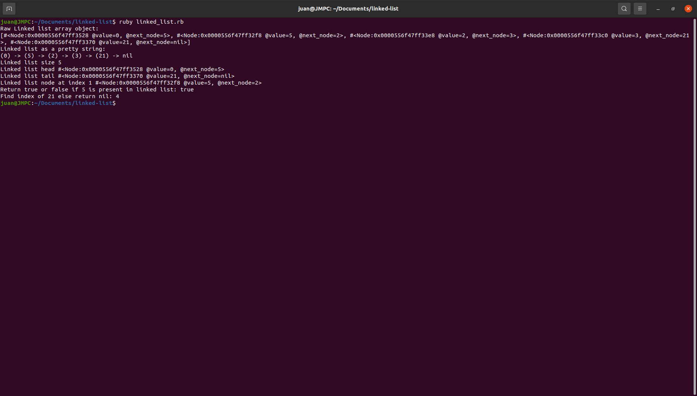

The purpose of this project was to implement a Linked list data structure in Ruby

Run the project locally(prerequisites: ruby):

1. Download or clone the repository.
2. Open the terminal inside the root folder and run:

ruby linked_list.rb